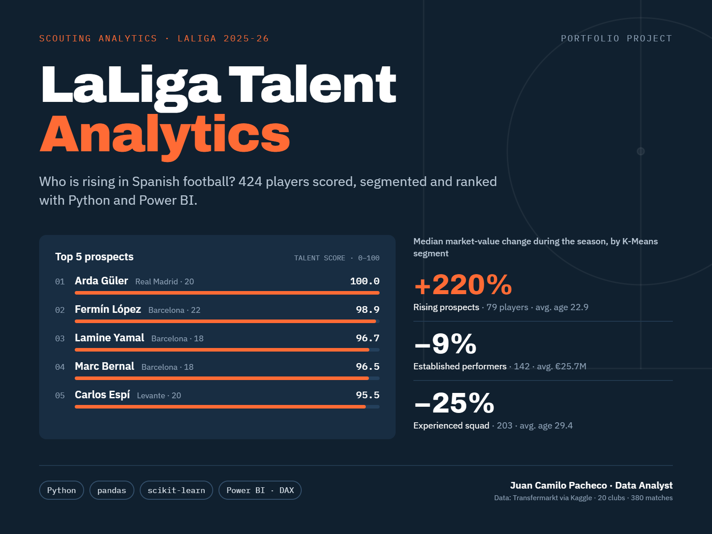
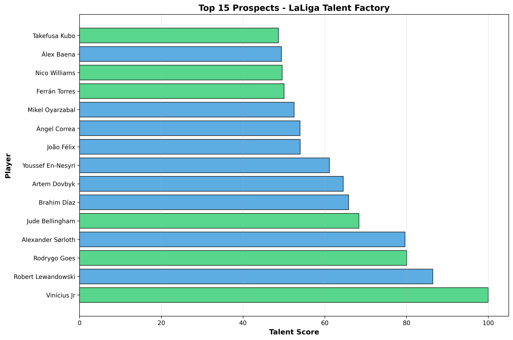
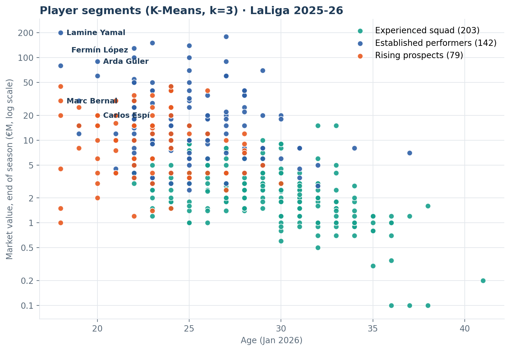
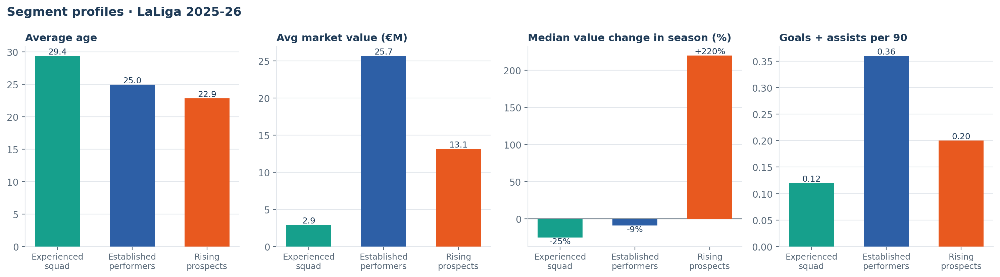
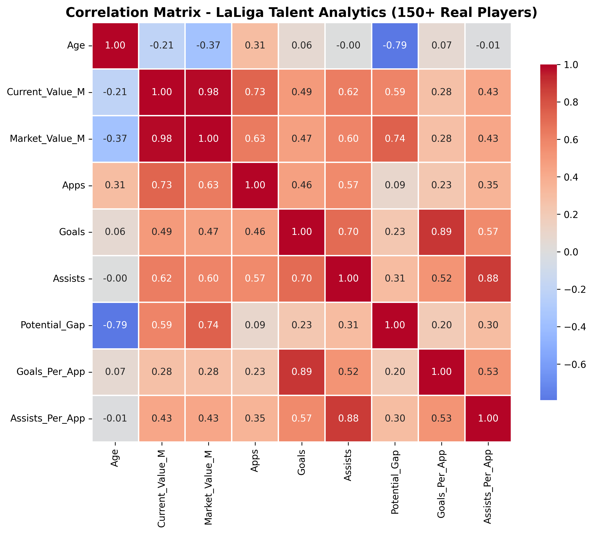
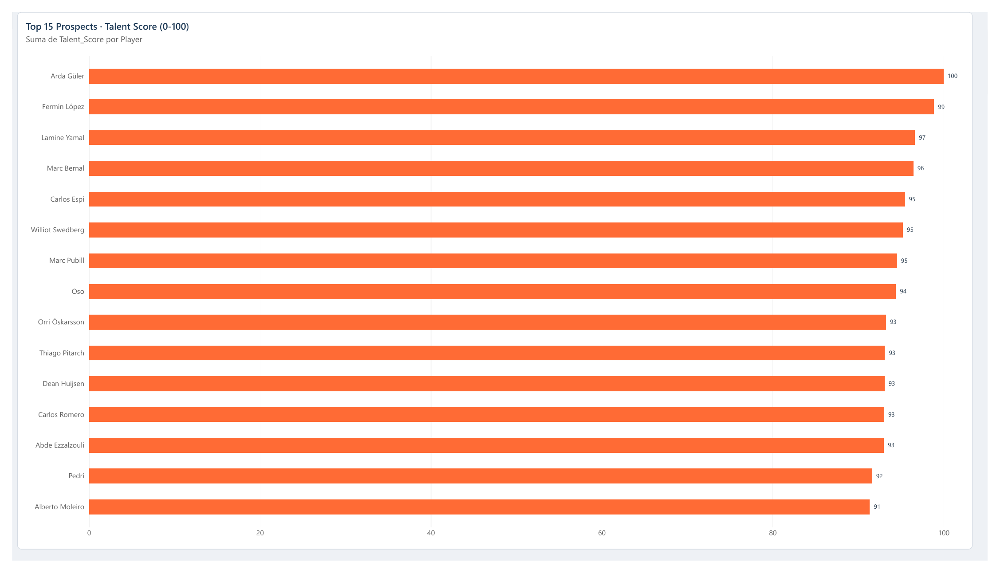
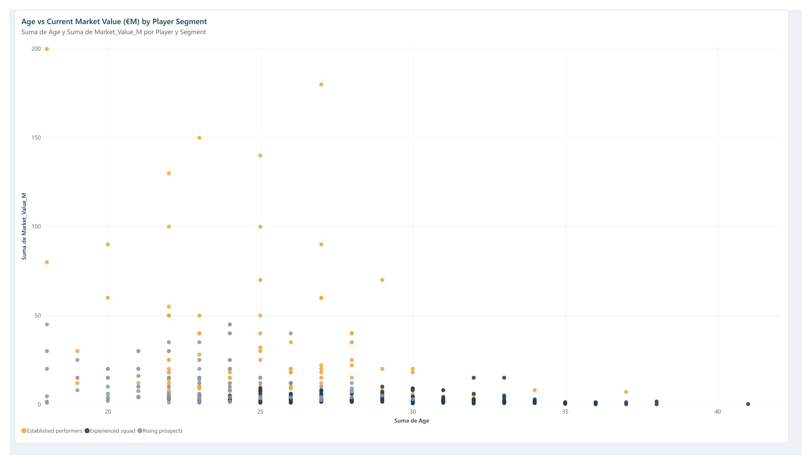
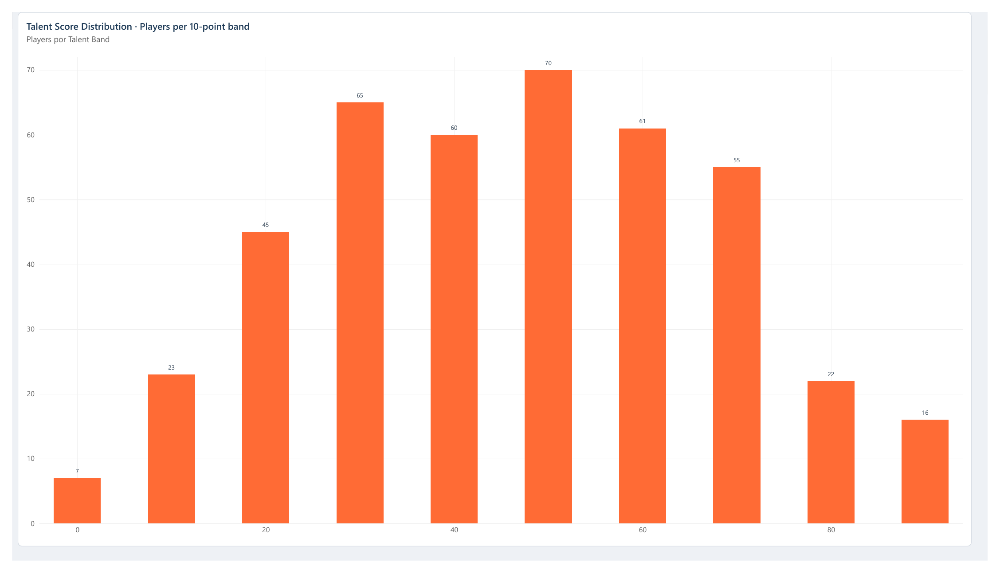
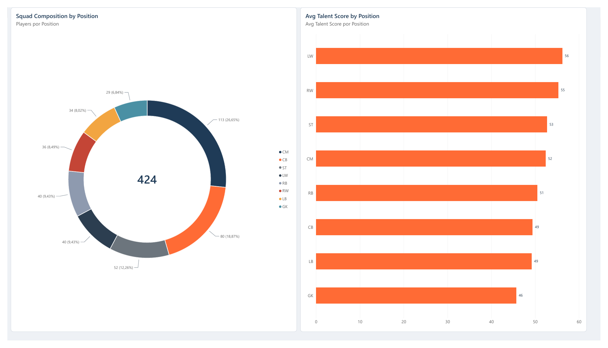
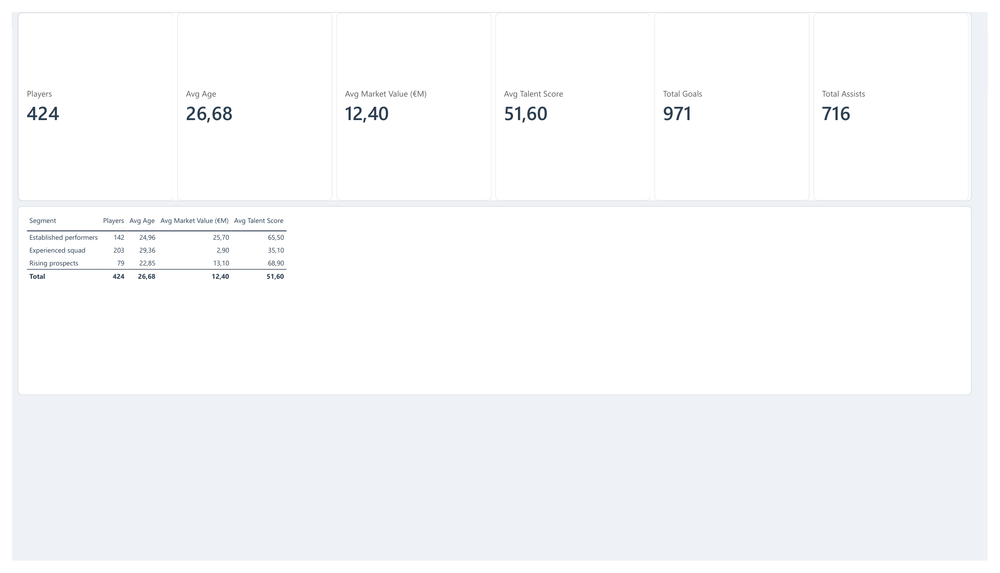

# LaLiga Talent Analytics · 2025-26



End-to-end football analytics project: **424 LaLiga players from the 2025-26 season**, built from public Transfermarkt data, scored with a transparent Talent Score, segmented with K-Means, and presented in a 5-page **Power BI** dashboard.

**Stack:** Python (pandas, scikit-learn, matplotlib) · Power BI (Power Query, DAX) · Git

---

## Key findings

| | |
|---|---|
| **Youth drives value growth** | Age and in-season market-value change are clearly negatively correlated (Spearman −0.52). The *Rising prospects* segment (avg. 22.9 years) had a median value change of **+220%**; the *Experienced squad* segment (avg. 29.4) a median of **−25%**. |
| **Output is only weakly priced in** | Goals per 90 correlates with market value at just 0.29: the market prices age and profile more than production, which is where data-driven scouting can find value. |
| **Top 15 is not only Barça and Madrid** | 7 of the top 15 play for Barcelona (4) or Real Madrid (3); the other 8 come from Levante, Celta, Atlético, Sevilla, Real Sociedad, Espanyol, Betis and Villarreal. |
| **Biggest value jumps** | Carlos Espí (Levante, 20) went from €2M to €20M; Oso (Sevilla, 22) from €0.2M to €10M. |

---

## Data

- **Source:** [Football Data from Transfermarkt](https://www.kaggle.com/datasets/davidcariboo/player-scores) (Kaggle, by davidcariboo): match-level appearances, player profiles and market-value history.
- **Scope:** LaLiga (`ES1`), season 2025-26 (380 matches, 15 Aug 2025 – 24 May 2026), players with **≥ 450 league minutes** → **424 players, 20 clubs**.
- **Validation:** the dataset accounts for 971 of the season's 1,024 league goals; the difference is own goals and players under the minutes threshold.

| Column | Definition |
|---|---|
| `Team` | Club where the player logged the most league minutes (handles January transfers) |
| `Age` | Age on 1 Jan 2026 |
| `Current_Value_M` | Transfermarkt market value at the **start** of the season (€M) |
| `Market_Value_M` | Transfermarkt market value at the **end** of the season (€M) |
| `Potential_Gap` / `Potential_Pct` | Value change over the season (€M / %) |
| `Goals_Per90`, `Assists_Per90` | Production per 90 minutes |
| `Talent_Score` | 0–100 composite score (below) |
| `Cluster` | K-Means segment (0 = Experienced squad, 1 = Established performers, 2 = Rising prospects) |

---

## Method

### Talent Score (0–100)
A transparent, percentile-based heuristic, so a single outlier cannot dominate:

| Weight | Component | Note |
|---|---|---|
| 35% | Goals + assists per 90 | ranked **within position**, so defenders and keepers aren't penalised for not scoring |
| 25% | End-of-season market value | |
| 20% | Value growth during the season | |
| 20% | Youth | younger = higher |

The weighted percentile is rescaled to 0–100.



### Segmentation (K-Means, k = 3)
Standardised features: age, log market value, value growth (clipped), goals/90, assists/90, minutes.

| Segment | Players | Avg age | Avg value | Median value change | G+A per 90 |
|---|---|---|---|---|---|
| Experienced squad | 203 | 29.4 | €2.9M | −25% | 0.12 |
| Established performers | 142 | 25.0 | €25.7M | −9% | 0.36 |
| Rising prospects | 79 | 22.9 | €13.1M | +220% | 0.20 |





---

## Power BI dashboard

`dashboards/LaLiga-Talent-Analytics.pbix`: 5 pages, custom theme (`dashboards/laliga-theme.json`), DAX measures for the KPIs, calculated columns for segments and Talent Score bands, and a Power Query load step that forces `en-US` number parsing so decimals load correctly on Spanish-locale machines.

| Page | Content |
|---|---|
| Top Prospects | Top 15 by Talent Score (Top N filter) |
| Age vs Value | Scatter of age vs end-of-season value, coloured by segment |
| Talent Distribution | Players per 10-point Talent Score band |
| Positions | Squad composition and average Talent Score by position |
| Summary KPIs | Players, average age, average value, goals, assists + segment summary table |







---

## Reproduce

```bash
git clone https://github.com/CamiloPacheco0402/LaLiga-Talent-Analytics.git
cd LaLiga-Talent-Analytics
pip install -r requirements.txt
```

1. Download the Kaggle dataset and place `games.csv`, `appearances.csv`, `players.csv`, `player_valuations.csv` and `clubs.csv` in `data/` (they're git-ignored; ~290 MB).
2. Run:

```bash
python scripts/build_dataset.py   # -> data/players_laliga_real_150.csv (scoring + segmentation)
python scripts/ml_analysis.py     # -> charts in dashboards/, top_prospects.csv, segment_summary.csv
```

3. Open the `.pbix` and click **Refresh**.

```
├── scripts/
│   ├── build_dataset.py     # data pipeline, Talent Score, K-Means
│   └── ml_analysis.py       # correlations, charts, summaries
├── data/
│   ├── players_laliga_real_150.csv
│   ├── top_prospects.csv
│   └── segment_summary.csv
└── dashboards/              # Power BI report, theme, PNG charts
```

---

## Limitations & next steps

- The Talent Score is a **ranking heuristic with judgment-based weights**, not a predictive model. The next step is to validate it, e.g. does it predict next-season value change?
- Goals and assists miss defensive and build-up contribution; adding event data (xG, progressive passes, duels) would make the score fairer to midfielders and defenders.
- Transfermarkt values are crowd-sourced estimates, not transfer fees.
- Extend to the other top-5 leagues and compare academies' output.

---

**Juan Camilo Pacheco Bermúdez**: Data Analyst · Sports Analytics
[LinkedIn](https://linkedin.com/in/camilopacheco) · [GitHub](https://github.com/CamiloPacheco0402)
